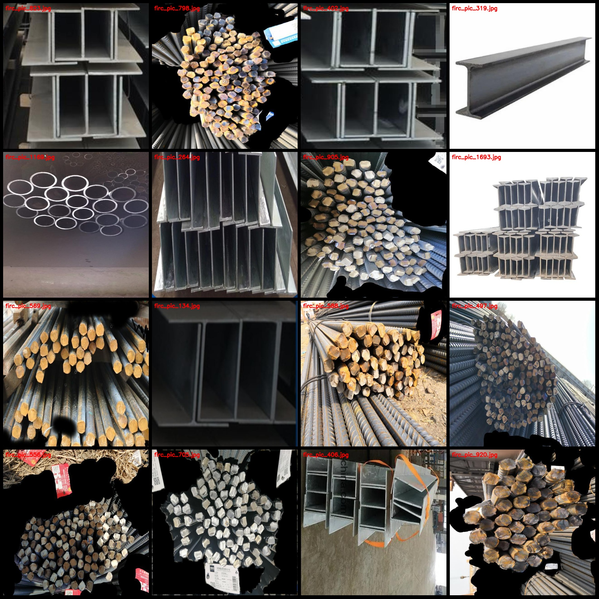
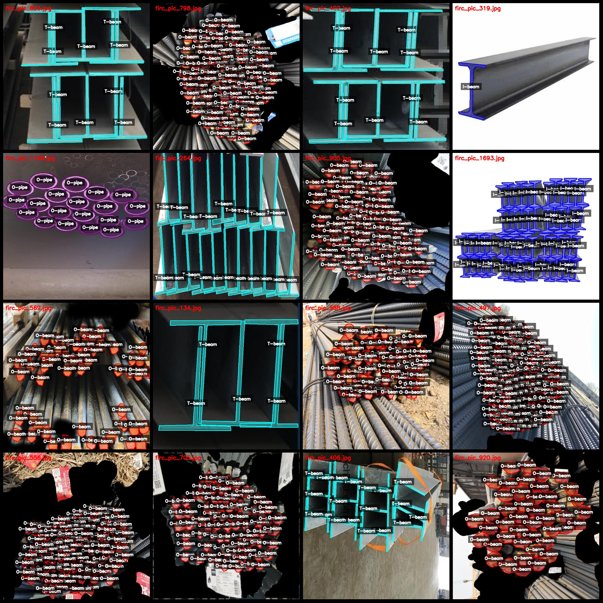
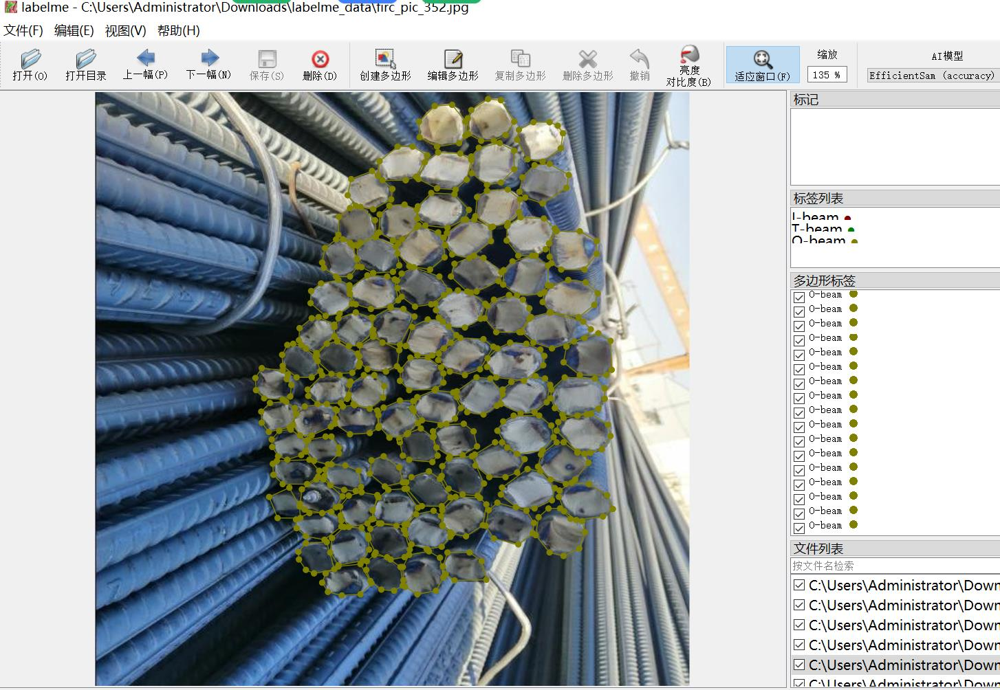

# Dataset of Different Types of Steel Beam Pipe Identification and Segmentation in LabelMe Format with 1710 Images and 7 Categories

The dataset consists of approximately one-third labeled images, with the remaining being enhanced images. 
The dataset is in labelme format (without mask files, only containing jpg images and corresponding json files). 
There are a total of 1710 jpg images. 
The number of annotations (json files) is also 1710. 
The number of categories: 7. 
The category names are ["I-beam", "L-beam", "O-beam", "O-pipe", "T-beam", "square-bar", "square-pipe"]. 
The number of bounding boxes per category is as follows: 
I-beam (I-beam) count = 740 
L-beam (L-beam) count = 1480 
O-beam (O-beam) count = 48832 
O-pipe (O-pipe) count = 20029 
T-beam (T-beam) count = 2312 
square-bar (square-bar) count = 7129 
square-pipe (square-pipe) count = 40473 
Total bounding box count: 120995
Using labelme = 5.5.0
Image resolution: 640x640
Annotation rule: Draw a polygon around the class for the given dataset.
Important notes: You can open and edit the dataset using LabelMe, and the JSON dataset needs to be converted into either mask or YOLOF format or Coco format for semantic segmentation or instance segmentation.
Special Notice: This dataset does not guarantee the accuracy of the trained model or weight files.
Image Preview:
Annotation Example:
Randomly selected 16 images:
Annotation drawing result:
LabelMe editing example image:
## Images

Here is a pay link on Stripe ( https://buy.stripe.com/3cs8yP7sY87d0vu9AB ). Please contact me lonlonago@foxmail.com after funding $89, and I will send you a complete data files , thank you!

